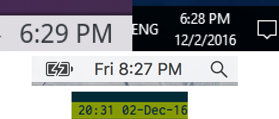
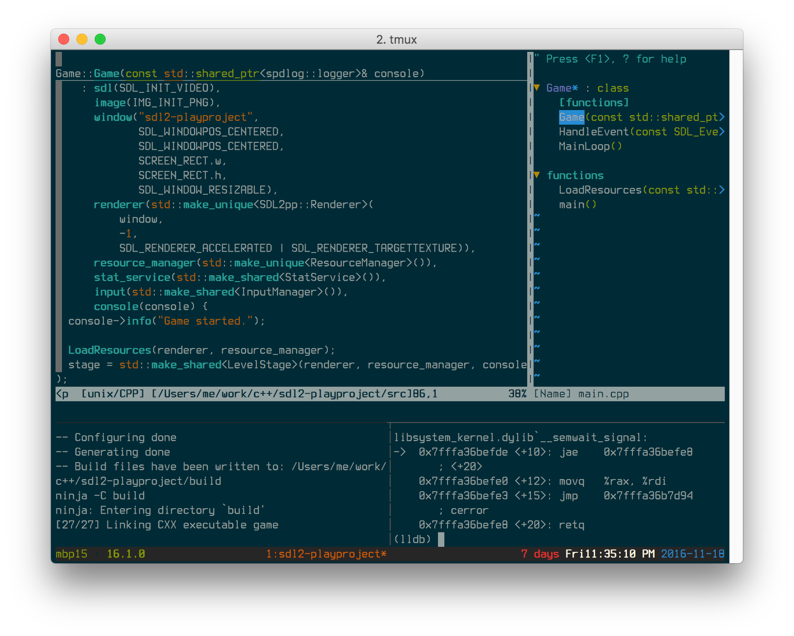
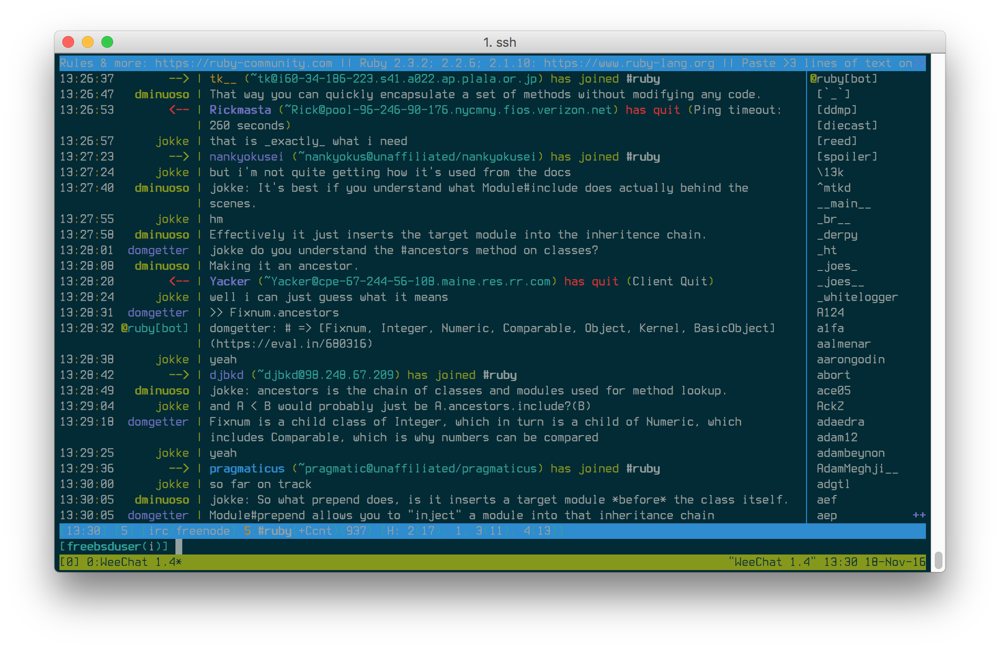

{mainmatter}

# Thinking in tmux {#thinking-tmux}

In the world of modern computing, user interaction has 2 realms:

1. The text realm
2. The graphical realm

tmux lives in the graphical realm in which fixed-width fonts appear in
a rectangular grid in a window, like in a terminal from the 1980s.

## Window manager for the terminal

tmux is to the console what a desktop is to gui apps. It's a world inside the
text dimension. Inside tmux you can:

- multitask inside the terminal, run multiple applications
- have multiple command lines (pane) in the same window
- have multiple windows (window) in the workspace (session)
- switch between multiple workspaces, like virtual desktops

|**tmux**           |**"Desktop"-Speak**   |**Plain English**                  |
|-------------------|----------------------|-----------------------------------|
|Multiplexer        |Multi-tasking         |Multiple applications              |
|                   |                      |simulataneously.                   |
|-------------------|----------------------|-----------------------------------|
|Session            |Desktop               |Applications are visible here      |
|-------------------|----------------------|-----------------------------------|
|Window             |Virtual Desktop or    |A desktop that stores it own screen|
|                   |applications          |screen			       |
|-------------------|----------------------|-----------------------------------|
|Pane               |Application           |Performs operations                |

Heck, you even get a clock. Just like in a graphical desktop environment.

## Multitasking

tmux allows you to 
keep multiple terminals running on the same screen.

(After all, that's where the abbreviation "tmux" comes from - **T**erminal
**Mu**ltiple**x**er.)

In addition to having multiple terminals on one screen, tmux allows you to
create and link multiple "windows", all within the confines of the tmux session
you attached.

Even better, you can copy and paste as well as scroll. No
requirement for graphics either, so you have full power even if you're SSH'ing
or on a system without X.

Here are a few common scenarios:

Running `tail -F /var/log/apache2/error.log` in a
pane to get a live stream of the latest system events.

Running a file watcher like [watchman](https://github.com/facebook/watchman),
[gulp-watch](https://github.com/gulpjs/gulp/blob/master/docs/API.md#gulpwatchglob-opts-tasks),
[grunt-watch](https://github.com/gruntjs/grunt-contrib-watch), [guard](https://github.com/guard/guard)
or [entr](http://entrproject.org/). On file change, you could do stuff like:

- rebuild LESS or SASS files, minimize CSS and/or assets and static files
- lint with linters like [cpplint](https://github.com/google/styleguide/tree/gh-pages/cpplint),
  [Cppcheck](http://cppcheck.sourceforge.net/), [rubocop](https://github.com/bbatsov/rubocop),
  [ESLint](http://eslint.org/), or [Flake8](http://flake8.pycqa.org/en/latest/)
- rebuild with `make` or [`ninja`](https://ninja-build.org/)
- reload your [Express](http://expressjs.com/) server
- run any other custom command to your liking

Keeping a text editor like vim, emacs, pico, nano, etc. open in a main pane,
while leaving two other open for CLI commands and building via `make` or
`ninja`.

You can see with tmux, you very quickly have the makings of an IDE! And it's on
your terms.

## Keep your applications running in the background

Sometimes in GUI applications you'll have an option to minimize an application.  The application is out of the sight, but running in the
background.

In tmux, a similar concept exists where we can "detach" a tmux session.

This is especially cool if:

- On a local machine, you start all your normal terminal applications within
  a tmux session, you restart X. Instead of losing your processes as your
  normally would if you were using an X terminal like xterm or konsole, you'd
  be able to `tmux attach` after and find all processes were alive and kicking
  all along :)
- Same applies for remote SSH applications and workspaces you run in tmux. You
  can detach your tmux workspace at work before you clock out, then next morning
  reattach your session. Ahhh. Refreshing. :)
  
  Sometimes you may have one of those rare servers you rarely log into. it could
  be that cloud instance you have that you log into 9 months later, and as a
  reflex, `tmux attach` to see if there we anything on there. And boom, you're
  back in a session that's 9 months old. It's like a hack to restore your short
  term memory.

Chatting on [irssi](https://irssi.org/) or [weechat](https://weechat.org/),
one of the "classic combos", along with a [bitlbee](https://www.bitlbee.org)
server to manage AIM, MSN, Google Talk, Jabber, ICQ, even Twitter. Then you can
detach your IRC and "idle" in your favorite channels, stay online on instant
messengers, and get back to your messages when you return.

Some (myself included) use it to keep development servers running. Hearty
emphasis on *development*, I would advise daemonizing and wrapping your
production web applications using a tool like [supervisor](http://supervisord.org/)
with its own safe environmental settings.

You can also have multiple users attach their clients to the same sessions,
which is great for pair programming.  If you were in the same session, you
and the other person would see the same thing, share the same input, and the
same active window and pane.

The above are just examples, but any general workspace you'd normally use in a
terminal for any task can gain the benefit of you being able to persist it! 
That includes projects or repetitive efforts you'd multitask on.

Q> ### Do tmux sessions persist after a system restart?
Q>
Q> Unfortunately not. A restart will kill the tmux server and any processes
Q> running within it.
Q>
Q> Thankfully, the modern server can stay online for a long time. Even for
Q> consumer laptops and PC's with a day or two uptime, having tmux persist
Q> tasks for organizational purposes is satisfactory to run it.
Q>
Q> It comes as a disappointment because some are interested in the idea of
Q> being able to persist a tree of processes after restart. That goes out of
Q> scope of what tmux is meant to do.
Q>
Q> For tasks you repeat often, you can always use a tool like
Q> [tmuxp](https://github.com/tony/tmuxp), [tmuxinator](https://github.com/tmuxinator/tmuxinator)
Q> or [teamocil](https://github.com/remiprev/teamocil) to resume common
Q> sessions.
Q>
Q> In addition to session managers, [tmux-resurrect](https://github.com/tmux-plugins/tmux-resurrect)
Q> is a tool that attempts to preserve running programs, working directories and
Q> so on within tmux. The benefit with tmux-resurrect is there's no JSON/YAML
Q> config needed.
