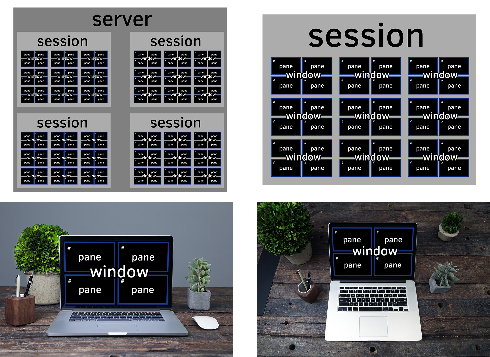

{mainmatter}

# Thinking in tmux {#thinking-tmux}

In the world of modern computing, user interaction has 2 realms:

1. The text realm
2. The graphical realm

tmux lives in the text realm in which fixed-width fonts appear in
a rectangular grid in a window, like in a terminal from the 1980s.

## Window manager for the terminal

tmux is to the console what a desktop is to GUI apps. It's a world inside the
text dimension. Inside tmux, you can:

- multitask inside the terminal, run multiple applications
- have multiple command lines (pane) in the same window
- have multiple windows (window) in the workspace (session)
- switch between multiple workspaces, like virtual desktops

|**tmux**           |**"Desktop"-Speak**   |**Plain English**                  |
|-------------------|----------------------|-----------------------------------|
|Multiplexer        |Multi-tasking         |Multiple applications              |
|                   |                      |simultaneously.                    |
|-------------------|----------------------|-----------------------------------|
|Session            |Desktop               |Applications are visible here      |
|-------------------|----------------------|-----------------------------------|
|Window             |Virtual Desktop or    |Desktop containing its own screen  |
|                   |applications          |     			       |
|-------------------|----------------------|-----------------------------------|
|Pane               |Application           |Performs operations                |

Just like in a graphical desktop environment, they throw in a clock, too.

{width=75%}

## Multitasking

tmux allows you to keep multiple terminals running on the same screen. After
all, the abbreviation "tmux" comes from - **T**erminal **Mu**ltiple**x**er.

In addition to multiple terminals on one screen, tmux allows you to create and link
multiple "windows" within the confines of the tmux session you attached.

Even better, you can copy and paste and scroll. No requirement for graphics
either, so you have full power, even if you're SSH'ing or on a system without 
a display server such as [X](https://en.wikipedia.org/wiki/X.Org_Server).

Here are a few common scenarios:

- Running `$ tail -F /var/log/apache2/error.log` in a
  pane to get a live stream of the latest system events.
- Running a file watcher, like [watchman](https://github.com/facebook/watchman),
  [gulp-watch](https://github.com/gulpjs/gulp/blob/master/docs/API.md#gulpwatchglob-opts-tasks),
  [grunt-watch](https://github.com/gruntjs/grunt-contrib-watch), [guard](https://github.com/guard/guard),
  or [entr](https://eradman.com/entrproject/). On file change, you could do stuff like:
  - rebuild LESS or SASS files, minimize CSS and/or assets and static files
  - lint with linters, like [cpplint](https://github.com/google/styleguide/tree/gh-pages/cpplint),
    [Cppcheck](http://cppcheck.sourceforge.net/), [rubocop](https://github.com/bbatsov/rubocop),
    [ESLint](http://eslint.org/), or [Flake8](http://flake8.pycqa.org/en/latest/)
  - rebuild with `make` or [`ninja`](https://ninja-build.org/)
  - reload your [Express](http://expressjs.com/) server
  - run any other custom command of your liking
- Keeping a text editor, like vim, emacs, pico, nano, etc., open in a main pane,
  while leaving two others open for CLI commands and building via `make` or
  `ninja`.

With tmux, you quickly have the makings of an IDE! And on your terms.

## Keep your applications running in the background

Sometimes, GUI applications will have an option to be sidelined to the system
tray to run in the background.  The application is out of sight, but events and
notifications can still come in, and the app can be instantly brought to the
foreground.

In tmux, a similar concept exists, where we can "detach" a tmux session.

Detaching can be especially useful on:

- Local machines. You start all your normal terminal applications within
  a tmux session, you restart X. Instead of losing your processes as you
  normally would if you were using an X terminal, like xterm or konsole, you'd
  be able to `tmux attach` after and find all the processes inside that were
  alive and kicking all along.
- Remote SSH applications and workspaces you run in tmux. You
  can detach your tmux workspace at work before you clock out, then the next
  morning, reattach your session. Ahhh. Refreshing. :)
- Those servers you rarely log into. Perhaps, a cloud instance you log into 9
  months later, and as a reflex, `tmux attach` to see if there is anything on
  there. And boom, you're back in a session you've forgotten about, but still
  jogs your memory to what you were tweaking or fixing. It's like a hack to
  restore your memory.

## Powerful combos

Chatting on [irssi](https://irssi.org/) or [weechat](https://weechat.org/),
one of the "classic combos", along with a [bitlbee](https://www.bitlbee.org)
server to manage AIM, MSN, Google Talk, Jabber, ICQ, even Twitter. Then, you can
detach your IRC and "idle" in your favorite channels, stay online on instant
messengers, and get back to your messages when you return.

Some keep development services running in a session. Hearty emphasis on
*development*, you probably will want to daemonize and wrap your production web
applications, using a tool like [supervisor](http://supervisord.org/), with its
own safe environmental settings.

You can also have multiple users attach their clients to the same sessions,
which is great for pair programming.  If you were in the same session, you
and the other person would see the same thing, share the same input, and the
same active window and pane.

The above are just examples; any general workspace you'd normally use in a
terminal could work, especially projects or repetitive efforts you multitask
on. The *[tips and tricks](#tips-and-tricks)* section will dive into specific
flows you can use today.

Q> ### Do tmux sessions persist after a system restart?
Q>
Q> Unfortunately, no. A restart will kill the tmux server and any processes
Q> running within it.
Q>
Q> Thankfully, the modern server can stay online for a long time. Even for
Q> consumer laptops and PC's with a day or two uptime, having tmux persist
Q> tasks for organizational purposes is satisfactory to run it.
Q>
Q> It comes as a disappointment, because some are interested in being able to
Q> persist a tree of processes after restart. It goes out of the scope of what
Q> tmux is meant to do.
Q>
Q> For tasks you repeat often, you can always use a tool, like
Q> [tmuxp](https://github.com/tony/tmuxp), [tmuxinator](https://github.com/tmuxinator/tmuxinator),
Q> or [teamocil](https://github.com/remiprev/teamocil), to resume common
Q> sessions.
Q>
Q> Besides session managers, [tmux-resurrect](https://github.com/tmux-plugins/tmux-resurrect)
Q> attempts to preserve running programs, working directories, and
Q> so on within tmux. The benefit with tmux-resurrect is there's no JSON/YAML
Q> config needed.

## Summary

tmux is a versatile addition to your terminal toolbelt. It helps you cover the
gaps between multitasking and workspace organization you'd otherwise lose, since
there's no GUI. In addition, it includes a nice ability to detach workspaces to
the background and reattach later.

In the next chapter, we will touch on some terminal basics before diving
deeper into tmux.
