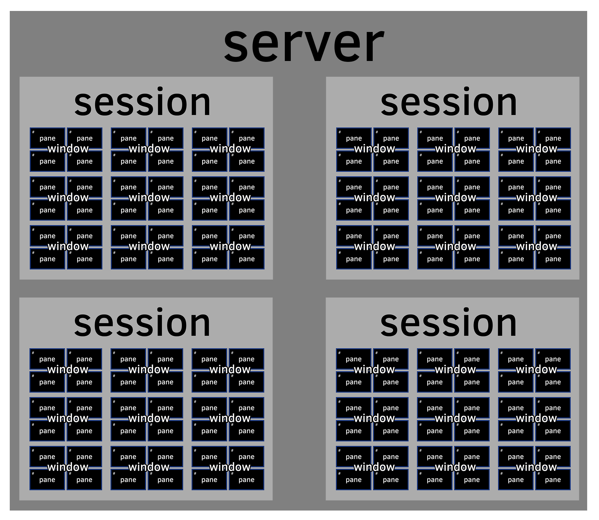

# Server {#server} 

Your server holds [Sessions](#sessions) and the [Windows](#windows) and
[Panes](#panes) within them.

What really happens in tmux is you are connected via a socket connection to a
server. What you see presented to you in your shell is merely a client
connection.

In this chapter, we go into the one of the secret sauces that allow your
terminal applications to persist for months or even years if you want to.

## Wait, What? tmux is a server?

Often when "server" is mentioned what comes to mind for many
may be rackmounted hardware, to others it may be software running
daemonized on a server and managed through a utility like upstart,
supervisor and so on.

Unlike web or database software, tmux doesn't require specialized
configuration settings or creating a service entry to start things.

tmux uses a client-server model, but the server is forked to the 
background for you.

## Zero config needed

You don't notice it, but when you use tmux normally, a server is launched and
being connected via a client.

tmux is so streamlined the book could continue to explain usage and not even
mention servers. But I'd rather you have a solid understanding that while tmux
feels like magic, it's really utilitarian first and foremost. One cannot deny
it's exquisitely executed from a user experience standpoint.

How is it utilitarian? We'll go into it more in future chapters where we dive
into [Formats](#formats), [Targets](#targets) and tools such as [libtmux](https://github.com/tony/libtmux)
that I made which utilize these features.

It surprises some because servers often beget a setup process. But just because
servers are involved doesn't entail hours of configuration on each machine you
run it on. There's no setup.

When people think server, they think pain. It invokes an image of digging
around `/etc/` for configuration files and flipping settings on and off just to
get basic systems online. But not with tmux. It's a server, but in the good way.

## Stayin' alive

The server part of tmux is how your sessions are able to stay alive even
after your client is detached.

The tmux server won't go away until all sessions are closed first.

## Servers hold sessions

One server can contain one or multiple [sessions](#sessions).

Recurring usage of tmux after a server already exist will create a new
session inside that server. 

W> ### Advanced: Multiple servers
W>
W> tmux is nimble. if you want to use a separate server, just pass in
W> the `-L` flag to any command.
W>
W> `tmux -L moo` - start a new tmux server + session if non-exists under
W> the socket name "moo"
W>
W> `tmux -L moo attach` try to re-attach to session if one exists

## How servers are "named"

The default name for the server is `default`, which is stored as a socket in
`/tmp`. The default directory for storing this can be overridden via setting
the `TMUX_TMPDIR` environment variable.

So something like:

{language=shell, line-numbers=off}
    $ export TMUX_TMPDIR=$HOME
    $ tmux

Will give you a tmux directory created within your `$HOME` folder. On OS X,
your home folder will probably be something like `/Users/yourusername`. On
other systems it may be `/home/yourusername`. If you want to find out, just type
`echo $HOME`.

## Clients

Servers will have clients (you) connecting to them.

When you connect to a session and see windows and panes, it's a client
connection into tmux.

You can retrieve a list of active client connections via:

{language=shell, line-numbers=off}
    $ tmux list-clients

There commands in practice are rather rare. As well as the other `list-`
commands for that matter. But they are part of the tools that make tmux highly
scriptable should you want to get creative. You can learn more about that in
[formats](#formats).
