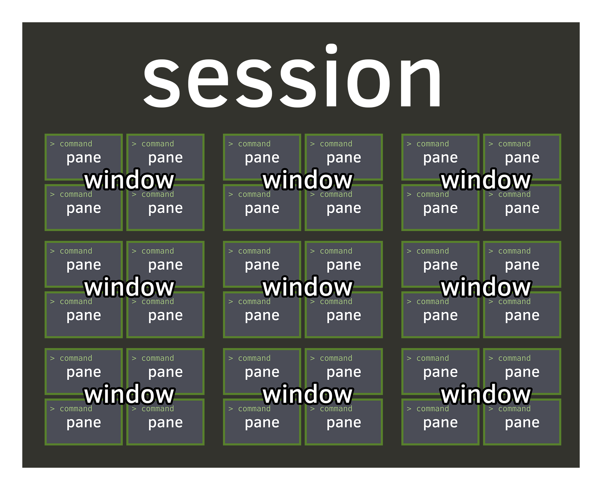
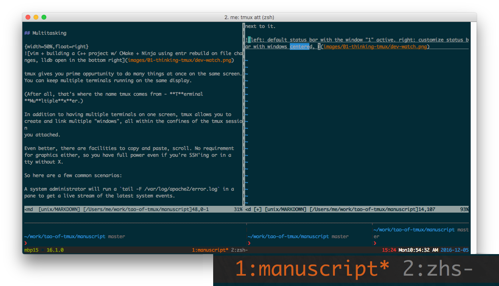
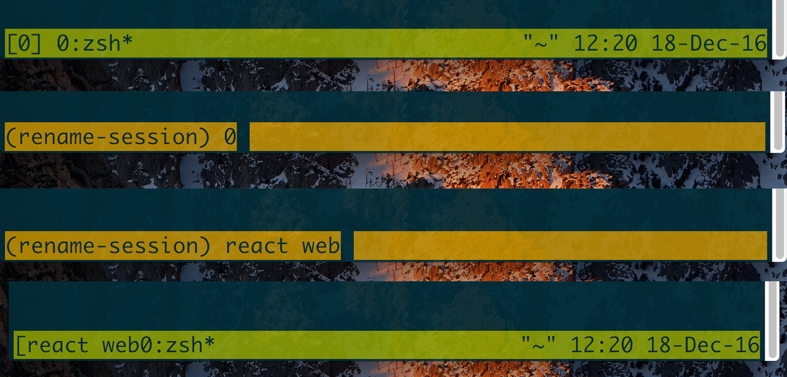

# Sessions {#sessions}

Welcome to the session. Being the highest level entity after your
[server](#server). Regardless of whether you're starting tmux fresh or attaching
an existing one, your interaction with tmux will have *at least* one session
running.

A session will hold one or more [windows](#windows). The [status bar]{#status-bar}
found at the bottom will include a list of windows.

The window you have selected currently may have a special color or a `*` symbol
next to it.

## Creating a session

The simplest command to create a new session is just typing `tmux`:

{language=shell, line-numbers=off}
    $ tmux

The `$ tmux` application without any commands is equivalent to
`$ tmux new-session`. Nifty!

By default, your session name will be given a number. Which isn't too
descriptive. What would be better is:

{language=shell, line-numbers=off}
    $ tmux new-session -s'my rails project'

## Switching sessions within tmux

Some acquire the habit of detaching their tmux client and reattaching via
`tmux att -t session_name`. Thankfully, you have the ability to switch to
session from within tmux!

### Keystroke

| Shortcut         | Action                                             |
|------------------|----------------------------------------------------|
|`Prefix` + `(`    | Switch the attached client to the previous session.|
|`Prefix` + `)`    | Switch the attached client to the next session.    |
|`Prefix` + `L`    | Switch the attached client back to the last        |
|                  | session.                                           |

`Prefix` + `s` will allow you to switch between sessions within the same tmux
client.

### Command line

{language=shell, line-numbers=off}
    $ tmux switch-client [-Elnpr] [-c target-client] [-t target-session]

## Moving around

You can move around between sessions as well.

| Shortcut         | Action                                             |
|------------------|----------------------------------------------------|
|`Prefix` + `s`    | Select a new session for the attached client       |
|                  | interactively.                                     |

## (Re)naming a tmux session

Sometimes the default session name given by tmux isn't descriptive enough. It
only takes a few seconds to update it.

You can name it whatever you want. Typically if I'm working on multiple web
projects in one session I'll name it "web". If I'm assigning one software
project to a single session, I'll name it after the software project. You'll
likely develop your own naming conventions, but pretty much anything is more
descriptive than the default. 

If you don't name your sessions, it'll be difficult to keep track of what is
inside that session from the outside. Sometimes you may forget you already have
a project opened that is a few days old and you can just re-attach or switch to
that.

### Keystroke

You can rename sessions from within tmux with `Prefix` + `$`. 
The status bar will be temporarily altered into a text field to allow altering
the session name.

### Command line

{language=shell, line-numbers=off}
    $ tmux rename-session [-t target-session] new-name
