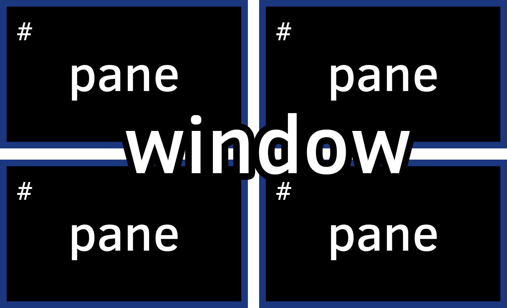
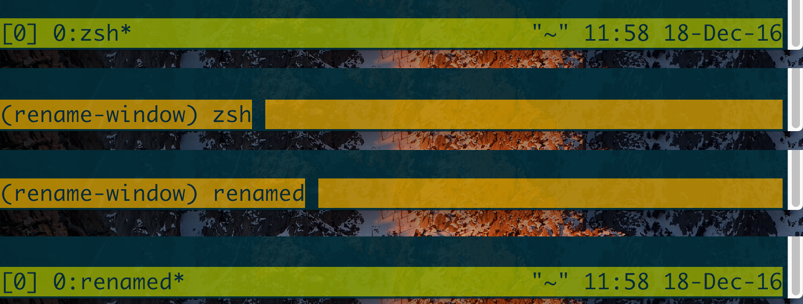
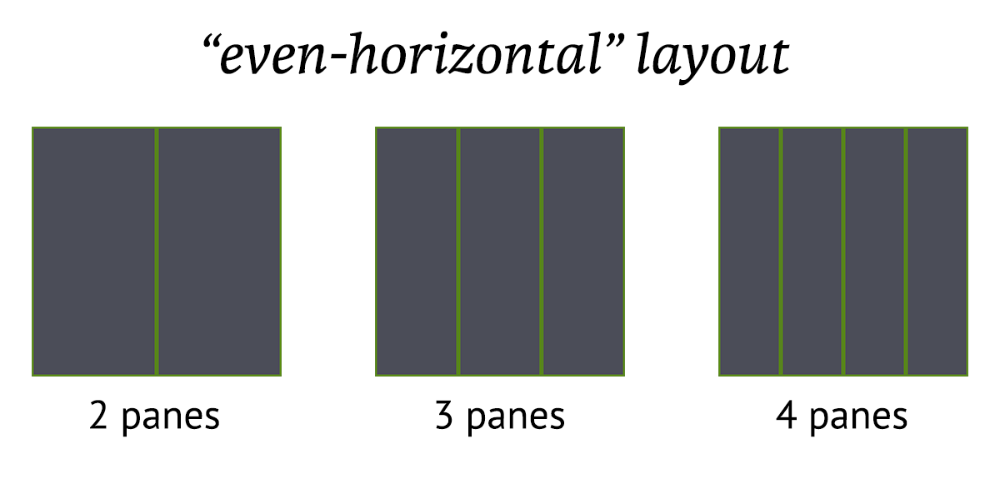
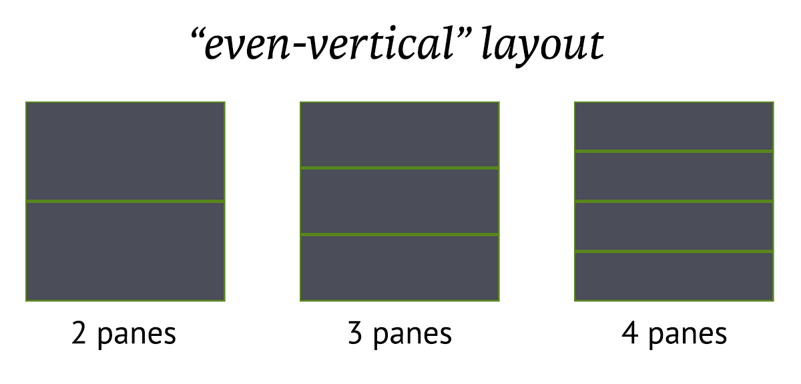
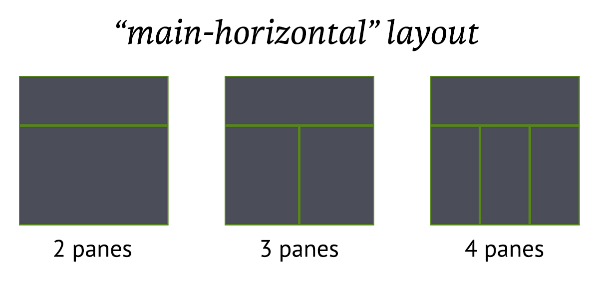
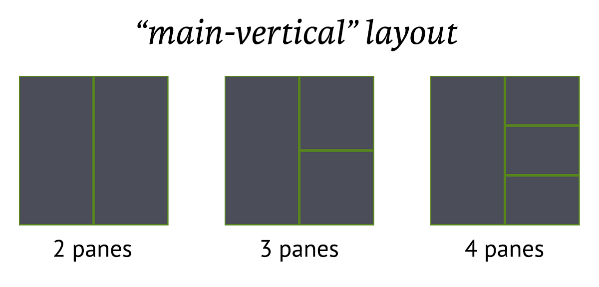
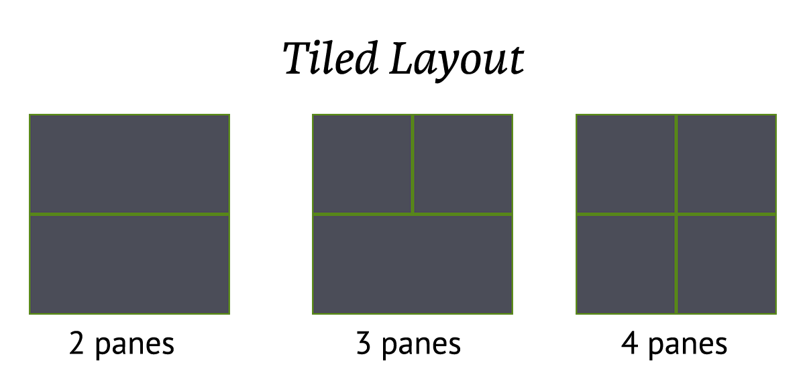

# Windows {#windows}

Windows hold [panes](#panes). They reside within a [session](#sessions).

You can see the current open windows through the status bar.

## Naming windows

Just like with sessions, windows can have names. Labelling them helps keep track
of what you're doing inside them.

`Prefix` + `,` will turn the tmux status line into an input field where the current
active window's name can be altered.

## Traversing Windows

`Prefix` + `1`, `Prefix` + `2`, and so on... will get you to navigate to windows
by their index.

Prompt for a window index (useful for indexes greater than 9) with `Prefix` +
`'`.

I> ### POWER MOVE: Search + Traverse Windows for Text
I> 
I> You can forward to a window with a match of a text string by doing `Prefix` +
I> `f`.

You can move to the last selected window with `Prefix` + `l`.

You can bring up a list of current windows with `Prefix` + `w`. The benefit of
this is it also gives you some info on what's inside the window. Helpful if
you're juggling around a lot of things!

## Moving Windows

`$ tmux move-window` can be used to move windows.

The accepted arguments are `-s` (the window you are moving) and `-t`, where you
are moving the window to.

You can also use `$ tmux movew` for short.

Example: move the current window to number 2:

{language=shell, line-numbers=off}
    $ tmux movew -t2

Example: move window 2 to window 1:

{language=shell, line-numbers=off}
    $ tmux movew -s2 -t1

The shortcut to prompt for an index to move the current window to is `Prefix` +
`.`.

## Layouts {#window-layouts}

`Prefix` + `space` switches window *layouts*. These are preset configurations
which handle proportions of [panes](#panes).

As of tmux 2.3, the supports layouts are:

Specific touch-ups can be done via [resizing panes](#resizing-panes).

To reset the proportions of the layout (such as after splitting or resizing
panes), you have to run `$ tmux select-layout` again for the layout.

This is different behavior than some [tiling window managers](https://en.wikipedia.org/wiki/Tiling_window_manager).
[awesome](https://awesomewm.org/) and [xmonad](http://xmonad.org/), for
instance, automatically handle proportions upon new items being added to their
layouts.

To maintain sane proportions in my [config](#config) I use this:

{language=shell, line-numbers=off}
    bind m set-window-option main-pane-height 60\; select-layout main-horizontal

This allows me to set a `main-horizontal` layout and automatically set the
bottom panes proportionally on the bottom everytime I hit `prefix` + `m`.

Layouts can also be totally custom. To get the custom layout snippet for your
current window, try this:

{language=shell, line-numbers=off}
    $ tmux lsw -F "#{window_active} #{window_layout}" | grep "^1" | cut -d " " -f2

To apply that layout, do this:

{language=shell, line-numbers=off}
    $ tmux lsw -F "#{window_active} #{window_layout}" | grep "^1" | cut -d " " -f2
    > 5aed,176x79,0,0[176x59,0,0,0,176x19,0,60{87x19,0,60,1,88x19,88,60,2}]

    # resize your panes or try doing this in another window to see the outcome
    $ tmux select-layout "5aed,176x79,0,0[176x59,0,0,0,176x19,0,60{87x19,0,60,1,88x19,88,60,2}]"
