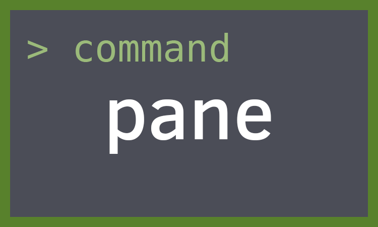
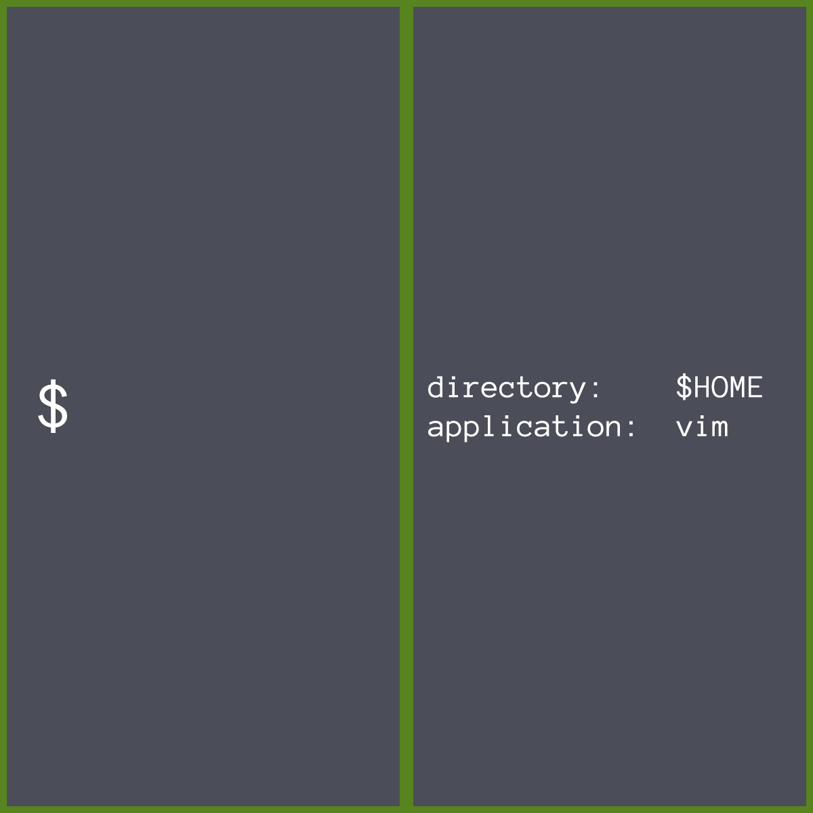
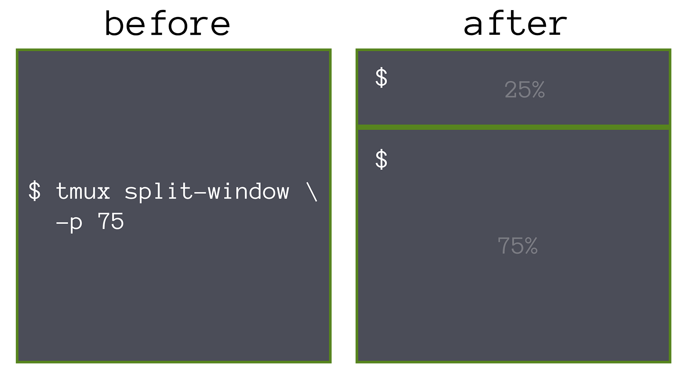

# Panes {#panes}

Panes are [pseudoterminals](https://en.wikipedia.org/wiki/Pseudoterminal) that
contain your shell (e.g. Bash, ZSH). They reside within a [window](#windows).

## Creating new panes

To create a new panes, you can `split-window` from within the current
[window](#windows) and pane you are in.

| Shortcut         | Action                                             |
|------------------|----------------------------------------------------|
|`Prefix` + `%`    | `split-window -h` (split horizontally)             |
|`Prefix` + `"`    | `split-window -v` (split vertically)               |

Example usage:

{language=shell, line-numbers=off}
    # Create a pane horizontally, in the $HOME directory, consuming 50% of the
    # width of the current pane
    $ tmux split-window -h -c $HOME -p 50 vim

{language=shell, line-numbers=off}
    # create new pane, split vertically with 75% height
    tmux split-window -p 75

## Traversing Panes {#pane-traversal}

| Shortcut         | Action                                             |
|------------------|----------------------------------------------------|
|`Prefix` + `;`    | Move to the previously active pane.                |
|`Prefix`+ `Up` /  | Change to the pane above, below,                   |
|`Down` / `Left` / | to the left, or to the                             |
|`Right`           | the right of the current pane.                     |
|`Prefix` + `o`    | Select the next pane in the current window.        |

I> *Movin around vimtuitively*
I>
I> If you like vim (hjkl) keybindings, add these to your [config](#config):
I>
I> {language=shell, line-numbers=off}
I>     # hjkl pane traversal
I>     bind h select-pane -L
I>     bind j select-pane -D
I>     bind k select-pane -U
I>     bind l select-pane -R

## Zoom in

To zoom in on a pane, navigate it and do `Leader` + `z`.

You can use any [pane traversal](#pane-traversal) to unzoom and move a pane at
the same time.

## Resizing panes {#resizing-panes}

Panes can be resized within [windows](#windows).

Another technique that resizes panes is [window layouts](#window-layouts). The
difference is a window layout switch the proportions and order of the panes.
Resizing the panes target a specific pane inside that window.

Resizing a pane in a specific layout may subsequently resize that whole row.

| Shortcut         | Action              |
|------------------|---------------------|
|`prefix M-Up`     | `resize-pane -U 5`  |
|`prefix M-Down`   | `resize-pane -D 5`  |
|`prefix M-Left`   | `resize-pane -L 5`  |
|`prefix M-Right`  | `resize-pane -R 5`  |
|`prefix C-Up`     | `resize-pane -U`    |
|`prefix C-Down`   | `resize-pane -D`    |
|`prefix C-Left`   | `resize-pane -L`    |
|`prefix C-Right`  | `resize-pane -R`    |

## Outputting pane to a file

You can output the display of a pane to a file.

{language=shell, line-numbers=off}
    $ tmux pipe-pane -o 'cat >>~/output.#I-#P'
