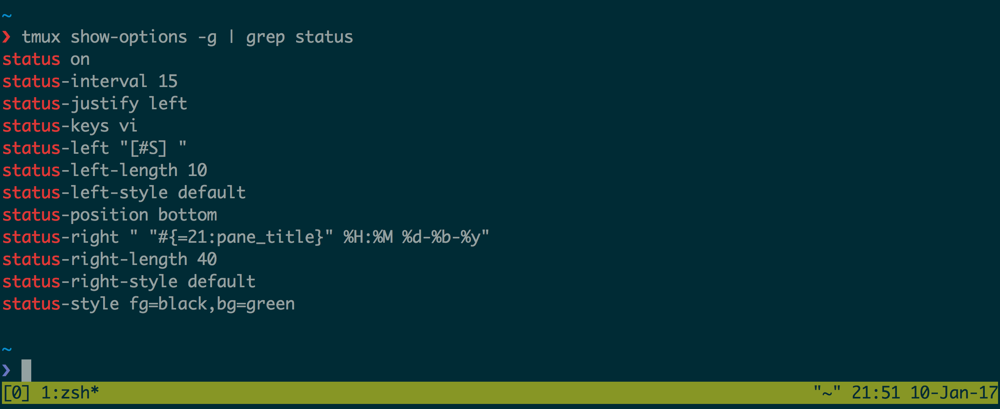
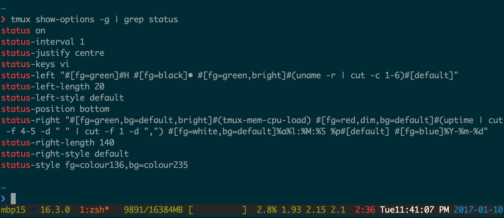

# Status bar {#status-bar}

The status bar, or *status line* lies in the bottom of the screen.

I> *Finding your current status line settings* 
I>
I> {language=shell, line-numbers=off}
I>     $ tmux show-options -g | grep status

## Example: default config

{line-numbers=off}
    status on
    status-interval 15
    status-justify left
    status-keys vi
    status-left "[#S] "
    status-left-length 10
    status-left-style default
    status-position bottom
    status-right " "#{=21:pane_title}" %H:%M %d-%b-%y"
    status-right-length 40
    status-right-style default
    status-style fg=black,bg=green

## Example: Dressed up

{line-numbers=off}
    status on
    status-interval 1
    status-justify centre
    status-keys vi
    status-left "#[fg=green]#H #[fg=black]• #[fg=green,bright]#(uname -r | cut -c 1-6)#[default]"
    status-left-length 20
    status-left-style default
    status-position bottom
    status-right "#[fg=green,bg=default,bright]#(tmux-mem-cpu-load) #[fg=red,dim,bg=default]#(uptime | cut -f 4-5 -d " " | cut -f 1 -d ",") #[fg=white,bg=default]%a%l:%M:%S %p#[default] #[fg=blue]%Y-%m-%d"
    status-right-length 140
    status-right-style default
    status-style fg=colour136,bg=colour235

Configs can print the output of an application. In this example,
[tmux-mem-cpu-load](https://github.com/thewtex/tmux-mem-cpu-load) is providing
system statistics in the right side section of the status line.

Source: <https://github.com/tony/tmux-config>
