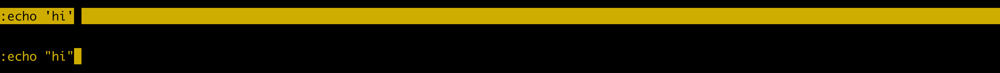

# Status bar {#status-bar}

The status bar, or *status line* lies in the bottom of the screen. It is
typically customize through the [tmux.conf config](#config).

I> *Finding your current status line settings* 
I>
I> {language=shell, line-numbers=off}
I>     $ tmux show-options -g | grep status

The status line is compromised of 3 sections. The status fields on either side
of the status line are customizable. The center field is a window list.

The `status-left` and `status-right` option can be configured to accept a
variety of variables.

## The symbology behind windows

The center part of the status line contains a list of windows, each of which can
be followed by a symbol:

| Symbol | Meaning                                                      |
|--------|--------------------------------------------------------------|
| *      | Denotes the current window.                                  |
| -      | Marks the last window (previously selected).                 |
| #      | Window is monitored and activity has been detected.          |
| !      | A bell has occurred in the window.                           |
| ~      | The window has been silent for the monitor-silence interval. |
| M      | The window contains the marked pane.                         |
| Z      | The window's active pane is zoomed.                          |

## Date and time

`status-left` and `status-right` accepts variables for the date. 

This happens via piping the status templates through [`format_expand_time`](https://github.com/tmux/tmux/blob/2.3/format.c#L868)
in `format.c`, which routes right into [`strftime(3)`](http://pubs.opengroup.org/onlinepubs/9699919799/functions/strftime.html)
from `time.h`.

For a full list of the variables you can use, view the documentation for
`strftime(1)`. You find that in the link above, or through your manpages by
typing `$ man strftime`.

## Shell command output

You can also call applications such as [tmux-mem-cpu-load](https://github.com/thewtex/tmux-mem-cpu-load).

## Styling

You can use `[bg=color]` and `[fg=color]` to adjust the text color and
background within for status line text. 

### Prompt colors

The benefit of wrapping your around this type of styling is you will see it
`message-command-style`, `message style` and so on.

Let's try this:

{language=shell, line-numbers=off}
    $ tmux set-option -ag message-style fg=yellow,blink\; set-option -ag message-style bg=black

## Tweaking your status bar, live!

So you want to customize your tmux status line before you write the changes to
your [config](#config) file.

First start by grabbing your current status line section you want to edit, for
instance:

{language=none, line-numbers=off}
    $ tmux show-options -g status-left
    > status-left "[#S] "
    $ tmux show-options -g status-right
    > status-right " "#{=21:pane_title}" %H:%M %d-%b-%y"

Also, you can try to snip the variable off with `| cut -d' ' -f2-`:

{language=none, line-numbers=off}
    $ tmux show-options -g status-left | cut -d' ' -f2-
    > "[#S] "
    $ tmux show-options -g status-right | cut -d' ' -f2-
    > " "#{=21:pane_title}" %H:%M %d-%b-%y"

## Turn your status line off

Turn it off:

{language=shell, line-numbers=off}
    $ tmux set-option status off

Turn it on:

{language=shell, line-numbers=off}
    $ tmux set-option status on

Toggle it (regardless or current state):

{language=shell, line-numbers=off}
    $ tmux set-option status

Bind toggling status line to `Prefix` + `q`:

{language=shell, line-numbers=off}
    $ tmux bind-key q set-option status

## Example: default config

{line-numbers=off}
    status on
    status-interval 15
    status-justify left
    status-keys vi
    status-left "[#S] "
    status-left-length 10
    status-left-style default
    status-position bottom
    status-right " "#{=21:pane_title}" %H:%M %d-%b-%y"
    status-right-length 40
    status-right-style default
    status-style fg=black,bg=green

## Example: Dressed up

{line-numbers=off}
    status on
    status-interval 1
    status-justify centre
    status-keys vi
    status-left "#[fg=green]#H #[fg=black]• #[fg=green,bright]#(uname -r | cut -c 1-6)#[default]"
    status-left-length 20
    status-left-style default
    status-position bottom
    status-right "#[fg=green,bg=default,bright]#(tmux-mem-cpu-load) #[fg=red,dim,bg=default]#(uptime | cut -f 4-5 -d " " | cut -f 1 -d ",") #[fg=white,bg=default]%a%l:%M:%S %p#[default] #[fg=blue]%Y-%m-%d"
    status-right-length 140
    status-right-style default
    status-style fg=colour136,bg=colour235

Configs can print the output of an application. In this example,
[tmux-mem-cpu-load](https://github.com/thewtex/tmux-mem-cpu-load) is providing
system statistics in the right side section of the status line.

In order to get tmux-mem-cpu-load built you have to install
[CMake](https://cmake.org/) and have a C++ compiler like
[clang](http://clang.llvm.org/) or [GCC](https://gcc.gnu.org/).

On Ubuntu, Debian and Mint machines you can do this via `$ sudo apt-get install
cmake build-essential`. On macOS w/ [brew](http://brew.sh/) via `$ brew install
cmake`.

Source: <https://github.com/tony/tmux-config>
