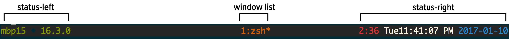
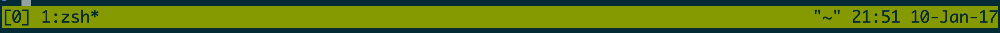
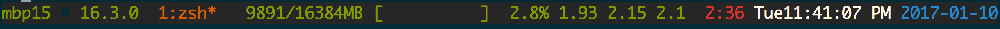
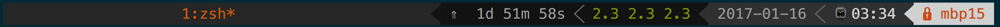

# Status bar {#status-bar}

The status bar, or *status line*, serves as customizable taskbar in the bottom
of tmux. It is comprised of 3 sections. The status fields on either side
of the status line are customizable. The center field is a list of windows.

The `status-left` and `status-right` option can be configured to accept 
many variables.

It's [configurable](#config) through the `.tmux.conf` file and modifiable live
through using `$ tmux set-option`.

I> *Finding your current status line settings* 
I>
I> {language=shell, line-numbers=off}
I>     $ tmux show-options -g | grep status

## The symbology behind windows

This window list is between the left and right status bar regions.

tmux helps indicate the the status of a window through symbols.

| Symbol | Meaning                                                      |
|--------|--------------------------------------------------------------|
| *      | Denotes the current window.                                  |
| -      | Marks the last window (previously selected).                 |
| #      | Window is monitored and activity has been detected.          |
| !      | A bell has occurred in the window.                           |
| ~      | The window has been silent for the monitor-silence interval. |
| M      | The window contains the marked pane.                         |
| Z      | The window's active pane is zoomed.                          |

Reminder: A pane can be [zoomed](#zoom-pane) via `Prefix` + `z`. To unzoom,
press `Prefix` + `z` or move left / right / up / down panes.

## Date and time

`status-left` and `status-right` accept variables for the date. 

This happens via piping the status templates through [`format_expand_time`](https://github.com/tmux/tmux/blob/2.3/format.c#L868)
in `format.c`, which routes right into [`strftime(3)`](http://pubs.opengroup.org/onlinepubs/9699919799/functions/strftime.html)
from `time.h`.

A full list of variables can be found in the documentation for `strftime(3)`.
This can viewed through `$ man strftime` on Unix-like systems.

## Shell command output

You can also call applications, such as [tmux-mem-cpu-load](https://github.com/thewtex/tmux-mem-cpu-load)
and [conky](https://github.com/brndnmtthws/conky), and [powerline](#powerline).

## Styling

You can use `[bg=color]` and `[fg=color]` to adjust the text color and
background within for status line text. 

### Prompt colors

The benefit of wrapping your brain around this styling is you will see
it `message-command-style`, `message style` and so on.

Let's try this:

{lang="shell", line-numbers=off}
    $ tmux set-option -ag message-style fg=yellow,blink\; set-option -ag message-style bg=black

## Tweaking your status bar, live!

So, you want to customize your tmux status line before you write the changes to
your [config](#config) file.

Start by grabbing your current status line section you want to edit, for
instance:

{lang="text", line-numbers=off}
    $ tmux show-options -g status-left
    > status-left "[#S] "
    $ tmux show-options -g status-right
    > status-right " "#{=21:pane_title}" %H:%M %d-%b-%y"

Also, you can try to snip off the variable with `| cut -d' ' -f2-`:

{lang="text", line-numbers=off}
    $ tmux show-options -g status-left | cut -d' ' -f2-
    > "[#S] "
    $ tmux show-options -g status-right | cut -d' ' -f2-
    > " "#{=21:pane_title}" %H:%M %d-%b-%y"

## Turn your status line off

Turn it off:

{language=shell, line-numbers=off}
    $ tmux set-option status off

Turn it on:

{language=shell, line-numbers=off}
    $ tmux set-option status on

Toggle it (regardless or current state):

{language=shell, line-numbers=off}
    $ tmux set-option status

Bind toggling status line to `Prefix` + `q`:

{language=shell, line-numbers=off}
    $ tmux bind-key q set-option status

## Example: Default config

This is an example of the default config, you see if your tmux
configuration has no status styling.

{line-numbers=off}
    status on
    status-interval 15
    status-justify left
    status-keys vi
    status-left "[#S] "
    status-left-length 10
    status-left-style default
    status-position bottom
    status-right " "#{=21:pane_title}" %H:%M %d-%b-%y"
    status-right-length 40
    status-right-style default
    status-style fg=black,bg=green

## Example: Dressed up

{line-numbers=off}
    status on
    status-interval 1
    status-justify centre
    status-keys vi
    status-left "#[fg=green]#H #[fg=black]• #[fg=green,bright]#(uname -r | cut -c 1-6)#[default]"
    status-left-length 20
    status-left-style default
    status-position bottom
    status-right "#[fg=green,bg=default,bright]#(tmux-mem-cpu-load) #[fg=red,dim,bg=default]#(uptime | cut -f 4-5 -d " " | cut -f 1 -d ",") #[fg=white,bg=default]%a%l:%M:%S %p#[default] #[fg=blue]%Y-%m-%d"
    status-right-length 140
    status-right-style default
    status-style fg=colour136,bg=colour235

    # default window title colors
    set-window-option -g window-status-fg colour244  # base0
    set-window-option -g window-status-bg default

    # active window title colors
    set-window-option -g window-status-current-fg colour166  # orange
    set-window-option -g window-status-current-bg default

Configs can print the output of an application. In this example,
[tmux-mem-cpu-load](https://github.com/thewtex/tmux-mem-cpu-load) is providing
system statistics in the right-side section of the status line.

To build tmux-mem-cpu-load, you have to install [CMake](https://cmake.org/)
and have a C++ compiler, like [clang](http://clang.llvm.org/) or [GCC](https://gcc.gnu.org/).

On Ubuntu, Debian, and Mint machines, you can do this via `$ sudo apt-get
install cmake build-essential`. On macOS w/ [brew](http://brew.sh/) via `$ brew
install cmake`.

Source: <https://github.com/tony/tmux-config>

## Example: Powerline

The most full-featured solution available for tmux status lines is
[powerline](https://github.com/powerline/powerline/), which heavily utilizes the
shell command outputs, not only to give direct system statistics, but also to
generate graphical-like styling.

To get the styling to work correctly, special fonts must be installed. The
easiest way to use this is to install [powerline fonts](https://github.com/powerline/fonts),
a collection of fixed width coder fonts patched to support [Wingdings](https://en.wikipedia.org/wiki/Wingdings)-like
symbols.

[Installation instructions](https://powerline.readthedocs.io/en/latest/installation.html)
are on Read the Docs. For a better idea:

{language=shell, line-numbers=off}
    $ pip install --user powerline-status psutil

[psutil](https://github.com/giampaolo/psutil), a required dependency of
powerline, is a cross-platform tool to gather system information.

Assure you [properly configured python with your PATHs](#troubleshoot-site-paths) and try this:

{line-numbers=off}
    set -g status-interval 2
    set -g status-right '#(powerline tmux right)'

## Summary

Configuring the status line is optional. It can use the the output of programs
installed on your system to give you specialized information such as CPU, ram
and I/O usage. By default, you'll at least have a window list and a clock.

In addition, you can customize the colors. By default, it's only a green bar
with dark text, so take some time to customize yours if you want and save it to
your [configuration](#config).

In the next chapter, we will go into the command line and scripting features of
tmux.
