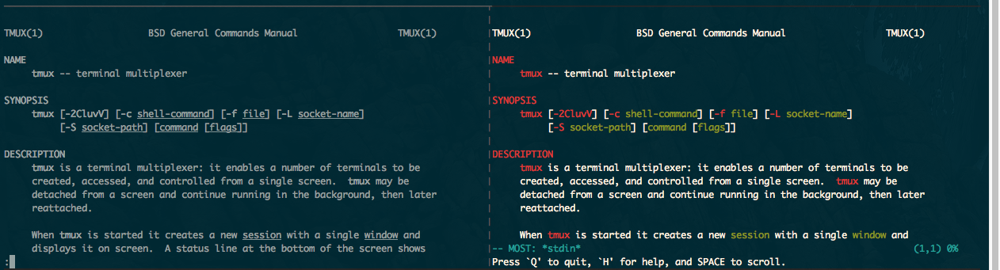

# Tips and Tricks {#tips-and-tricks}

## Read the tmux manual in style

`$ man tmux` is the command to load up the "[man page](https://en.wikipedia.org/wiki/Man_page)"
for tmux. You can do the same to find instructions for any command or entity
with a manpage entry; here's two fun ones:

{language=shell, line-numbers=off}
    $ man less
    $ man man
    $ man strftime

[most(1)](http://www.jedsoft.org/most/), a solid [`PAGER`](http://pubs.opengroup.org/onlinepubs/9699919799//utilities/man.html),
drastically improves readability of manual pages by acting as a syntax
highlighter.

To get this working, you need to set your `PAGER` [environmental variable](https://en.wikipedia.org/wiki/Environment_variable)
to point to the MOST binary. You can test it like this:

{language=shell, line-numbers=off}
    $ PAGER=most man ls

If you found you like `most`, you'll probably want to make it your default
manpage reader. You can do this by setting an environmental variable in your
"rc" ([Run Commands](https://en.wikipedia.org/wiki/Run_commands)) for your
shell. The location of the file depends on your shell. You can use `$ echo
$SHELL` to find it on most shells). In Bash and zsh, these are kept in
`~/.bashrc` or `~/.zshrc`, respectively:

{language=shell, line-numbers=off}
    export PAGER="most"

I often reuse my configurations across machines, and some of them may not have
`most` installed, so I will have my scripting only set `PAGER` if `most` is
found:

{language=shell, line-numbers=off}
    #!/bin/sh

    if command -v most > /dev/null 2>&1; then
        export PAGER="most"
    fi

Save this in a file, for example, to `~/.dot-config/most.sh`.

Then you can [`source`](https://en.wikipedia.org/wiki/Dot_(command)) it in via
your main rc file.

{language=shell, line-numbers=off}
    source $HOME/.dot-config/most.sh

Patterns like these help make your dot-configs portable, cross-platform, and
modular. For inspiration, you can fork, copy and paste from my permissively-
licensed config at <https://github.com/tony/.dot-config>.

## Log tailing

Not tmux specific, but powerful when used in tandem with it, you can run a
follow (`-f`) using [`tail(1)`](http://pubs.opengroup.org/onlinepubs/9699919799/utilities/tail.html).
More modern versions of tail have the `-F` (capitalized), which checks for file
renames and rotation. 

On OS X, you can do:

{language=shell, line-numbers=off}
    $ tail -F /var/log/system.log

and keep it running in a pane while log messages come in. It's like
Facebook newsfeed for your system, except for programmers and system
administrators.

For monitoring logs, [multitail](https://vanheusden.com/multitail/) provides a
terminal-friendly solution. It'd be an [*Inception*](http://www.imdb.com/title/tt1375666/)
moment, because you'd be using a log multiplexer in a terminal multiplexer.

## File watching

In my never-ending conquest to get software projects working in symphony with
code changes, I've come to taste test many file watching applications and
patterns. Pursing the holy grail feedback loop upon file changes, I've gradually
become the internet's unofficial connoisseur on them.

File watcher applications wait for a file to be updated, then execute a custom
command, such as restarting a server, rebuilding an application, running tests,
linters, and so on. It gives you, as a developer, instant feedback in the
terminal, empowering a tmux workspace to have IDE-like features, without the
bloat, memory and CPU fans roaring.

I eventually settled on [`entr(1)`](http://entrproject.org/), which works
superbly across Linux distros, BSDs and OS X / macOS.

The trick to make entr work is to [pipe](https://en.wikipedia.org/wiki/Pipeline_(Unix))
a list of files into it to watch.

Let's search for all [`.go`](https://en.wikipedia.org/wiki/Go_(programming_language))
files in a directory and [run tests](https://golang.org/cmd/go/#hdr-Test_packages)
on file change:

{language=shell, line-numbers=off}
    $ ls -d *.go | entr -c go test ./...

Sometimes, we may want to watch files recursively, but we need it to run
reliably across systems. We can't depend on `**` existing to grab files
recursively, since it's not portable. Something more POSIX-friendly would be
`find . -print | grep -i '.*[.]go'`:

{language=shell, line-numbers=off}
    $ find . -print | grep -i '.*[.]go' | entr -c go test ./...

To only run file watcher if entr is installed; let's wrap in a conditional
[`command -v`](http://pubs.opengroup.org/onlinepubs/9699919799/utilities/command.html)
test:

{language=shell, line-numbers=off}
    $ if command -v entr > /dev/null; then find . -print | grep -i '.*[.]go' | \
      entr -c go test ./...; fi

And have it fallback to `go test` in the event `entr` isn't installed. This
allows your command to degrade gracefully. You'll thank me when use this
snippet in conjunction with a [session manager](#session-manager):

{language=shell, line-numbers=off}
    $ if command -v entr > /dev/null; then find . -print | grep -i '.*[.]go' | \
      entr -c go test ./...; else go test ./...; fi

If the project is a team or open source project where a user never used the
command before, and could missing a required software package, we can give
a helpful message. This shows a notice to the user to install entr if not
installed on the system:

{language=shell, line-numbers=off}
    $ if command -v entr > /dev/null; then find . -print | grep -i '.*[.]go' | \
      entr -c go test ./...; else go test ./...; echo "\nInstall entr(1) to \"
      echo "run tasks when files change. \nSee http://entrproject.org/"; fi

Here's why you want patterns like above: You can put it into a [`Makefile`](https://en.wikipedia.org/wiki/Makefile)
and commit it to your project's [VCS](https://en.wikipedia.org/wiki/Version_control),
so you and other developers can have access to this reusable command across
different UNIX-like systems, with and without certain programs installed.

Note: You may have to convert the indentation within the `Makefile`s from spaces
to tabs.

Let's see what a `Makefile` with this looks like:

{language=makefile, line-numbers=off}
    watch_test:
        if command -v entr > /dev/null; then find . -print | grep -i '.*[.]go' | entr -c go test ./...; else go test ./...; echo "\nInstall entr(1) to run tasks when files change. \nSee http://entrproject.org/"; fi

To run this, do `$ make watch_test` in the same directory as the `Makefile`.

But it's still a tad bloated and hard to read. We have a couple tricks at our
disposal. One would be to add continuation to the next line with a trailing
backslash (`\`):

{language=makefile, line-numbers=off}
    watch_test:
        if command -v entr > /dev/null; then find . -print | \
        grep -i '.*[.]go' | entr -c go test ./...; \
        else go test ./...; \
        echo "\nInstall entr(1) to run tasks on file change. \n"; \
        echo "See http://entrproject.org/"; fi

Another would be to break the command into variables and `make` subcommands. So:

{language=makefile, line-numbers=off}
    WATCH_FILES= find . -type f -not -path '*/\.*' | \
    grep -i '.*[.]go$$' 2> /dev/null

    test:
            go test $(test) ./...

    entr_warn:
            @echo "-------------------------------------------------"
            @echo " ! File watching functionality non-operational ! "
            @echo "                                                 "
            @echo " Install entr(1) to run tasks on file change.    "
            @echo " See http://entrproject.org/                     "
            @echo "-------------------------------------------------"

    watch_test:
            if command -v entr > /dev/null; then ${WATCH_FILES} | \
            entr -c $(MAKE) test; else $(MAKE) test entr_warn; fi

`$(MAKE)` is used for portability. One reason is recursive calls, such
as here. On BSD systems, you may try invoking `make` via `gmake`
(to call [GNU Make](https://www.gnu.org/software/make/) specifically). This
happened to me, while building PDFs for the book [AlgoXY](https://github.com/liuxinyu95/AlgoXY/).
I had to [write a patch](https://github.com/liuxinyu95/AlgoXY/pull/16) to
make it properly use `$(MAKE)` for recursive calls.

The `$(test)` after `go test` allows passing a shell variable with arguments
in it. So, you could do `make watch_test test='-i'`. For examples of a similar
`Makefile` in action, see [the one in my tmuxp project](https://github.com/tony/tmuxp/blob/master/Makefile).
The project is licensed BSD (permissive), so you can grab code and use it
in compliance with the [LICENSE](https://github.com/tony/tmuxp/blob/master/LICENSE).

One more thing, let's say you're running a server, like [Gin](https://github.com/gin-gonic/gin),
[Iris](https://github.com/kataras/iris), or [Echo](https://github.com/labstack/echo).
`entr -c` likely won't be restarting the server for you. Try entering the `-r`
flag to send a [`SIGTERM`](https://en.wikipedia.org/wiki/Unix_signal) to the
process before restarting it. Combining the current `-c` flag with the new `-r`
will give you `entr -rc`:

{language=makefile, line-numbers=off}
    run:
            go run main.go

    watch_run:
            if command -v entr > /dev/null; then ${WATCH_FILES} | \
            entr -c $(MAKE) run; else $(MAKE) run entr_warn; fi

## Session Managers {#session-manager}

For those who use tmux regularly to perform repetitive tasks, such as opening
the same software project, viewing the same logs, etc., frequent tasks will
often end up leading to the creation of tmux scripts.

A user can use plain shell scripting to build their tmux sessions. However,
scripting is error prone, hard to debug, and requires tmux split windows into
panes in a certain order. In addition, there's the burden of assuring the shell
scripts are portable.

A declarative configuration in YAML or JSON configuration abstracts out the
commands, layout and options tmux has. It'd prevent the mistakes and repetition
scripting entails. These applications are called tmux *session managers*, and, in
differently ways, they programatically create tmux workspaces by runnings a
series of commands based off a config.

[Teamocil](https://github.com/remiprev/teamocil) and
[Tmuxinator](https://github.com/tmuxinator/tmuxinator) are the first ones I
tried. By far, the most popular one is tmuxinator. They are both programmed in
Ruby. There's also [tmuxomatic](https://github.com/oxidane/tmuxomatic), where
you can "draw" your tmux sessions in text and have tmuxomatic build the layout.

I sort of have a home team advantage here, as I'm author of [tmuxp](https://github.com/tony/tmuxp).
I wrote it, already having used teamocil and tmuxinator, but with many more
features. For one, it builds on top of [libtmux](https://github.com/tony/libtmux),
a library which abstracts tmux [server](#server), [sessions](#sessions),
[windows](#windows) and [panes](#panes) to build the state of tmux sessions. In
addition, it has a naive form of session freezing, support for JSON, more
flexible configuration options, and it will even offer to attach exiting
sessions, instead of redundantly running script commands against the
session if it's already running.

So, in tmuxp, we'll hollow out a tmuxp config directory with `$ mkdir ~/.tmuxp`
then create a YAML file at `~/.tmuxp/test.yaml`:

{language=yaml, line-numbers=off}
    session_name: 4-pane-split
    windows:
    - window_name: dev window
      layout: tiled
      shell_command_before:
        - cd ~/                    # run as a first command in all panes
      panes:
        - shell_command:           # pane no. 1
            - cd /var/log          # run multiple commands in this pane
            - ls -al | grep \.log
        - echo second pane         # pane no. 2
        - echo third pane          # pane no. 3
        - echo forth pane          # pane no. 4

gives a session titled *4-pane-split*, with one window titled *dev window* with
4 panes in it. 3 in the home directory; the other is in
`/var/log` and is printing a list of all files ending with `.log`.

To launch it, install tmuxp and load the configuration:

{language=shell, line-numbers=off}
    $ pip install --user tmuxp
    $ tmuxp -V   # verify tmuxp is installed, if not you need to fix your `PATH`
                 # to point to your python bin folder. More help below.
    $ tmuxp load ~/.tmuxp/test.yaml

If tmuxp isn't found, there is a [troubleshooting entry on fixing your
paths](#troubleshoot-site-paths) in the appendix.

## More code and examples

I've dusted off a C++ space shooter and a new go webapp I've been playing with.
They're licensed under MIT so, you can use them, copy and paste from them, etc:

- c++14 [space shooter minigame](https://github.com/tony/tot-cpp-shmup) - side
  scrolling [shmup](https://en.wikipedia.org/wiki/Shoot_'em_up) demo (sdl2,
  cmake, json resource manifests, linux/BSD/OS X compatible)
- golang [tmux web frontend](https://github.com/tony/tot-go-webapp) - display
  current tmux session and window information via browser ([gin](https://github.com/gin-gonic/gin),
  [bower](https://bower.io/))

Both support `tmuxp load .` within the project directory to load up the project.

Make sure to install [`entr(1)`](http://entrproject.org/) beforehand!

## tmux-plugins and tpm

[tmux-plugins](https://github.com/tmux-plugins) and [tmux package
manager](https://github.com/tmux-plugins/tpm) are a suite of tools dedicated
to enhancing the experience of tmux users.

- [tmux-resurrect](https://github.com/tmux-plugins/tmux-resurrect): Persists
  tmux environment across system restarts.
- [tmux-continuum](https://github.com/tmux-plugins/tmux-continuum): Continuous
  saving of tmux environment. Automatic restore when tmux is started. Automatic
  tmux start when computer is turned on.
- [tmux-yank](https://github.com/tmux-plugins/tmux-yank): Tmux plugin for
  copying to system clipboard. Works on OSX, Linux and Cygwin.
- [tmux-battery](https://github.com/tmux-plugins/tmux-battery): Plug and play
  battery percentage and icon indicator for Tmux.
