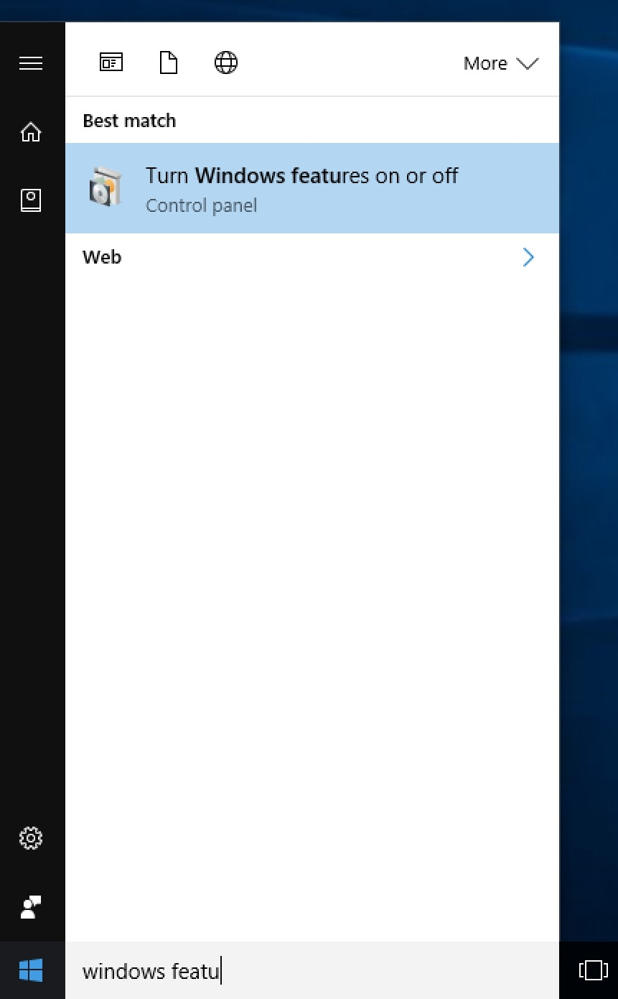
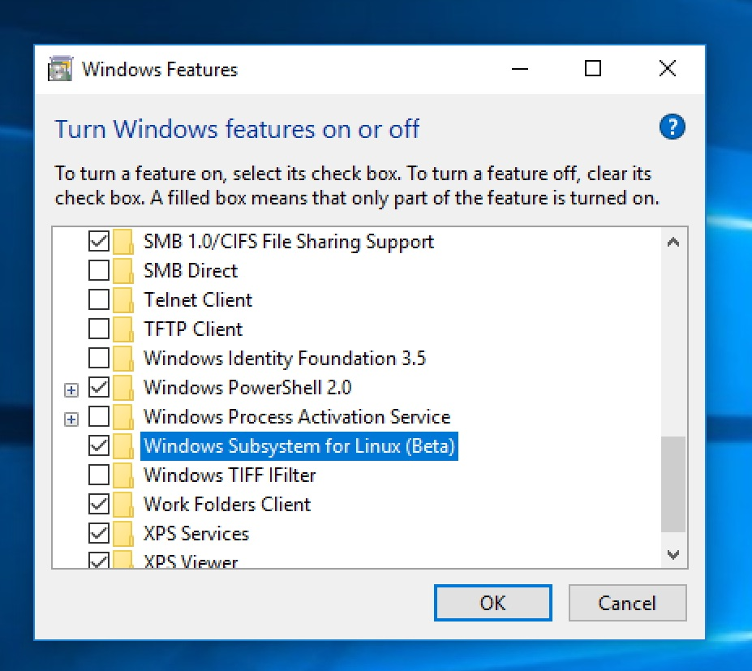
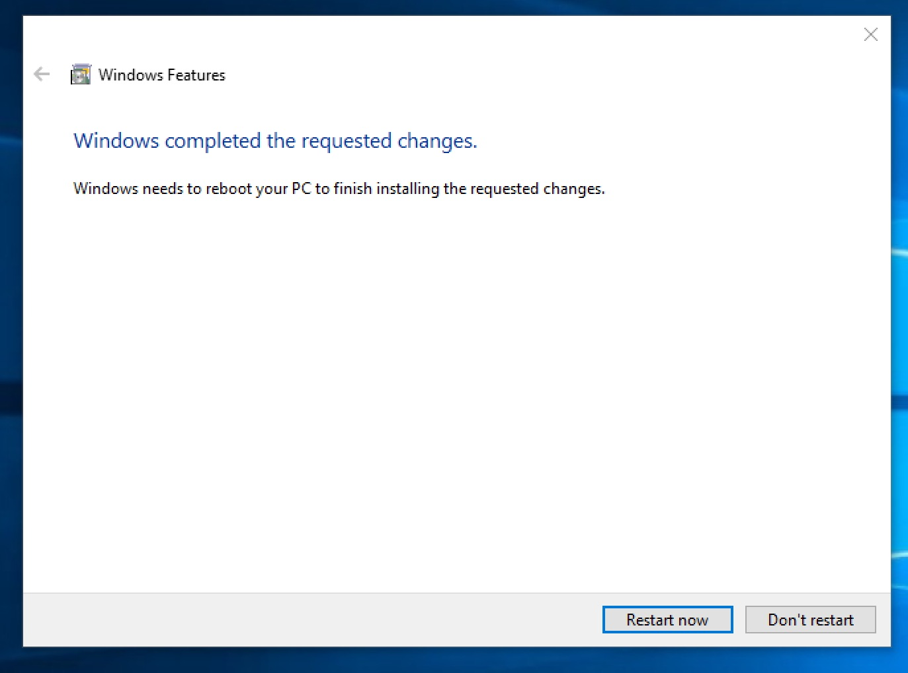
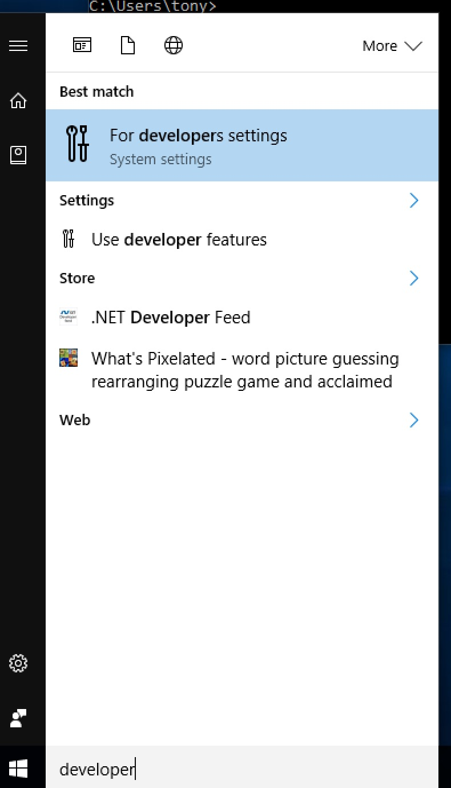
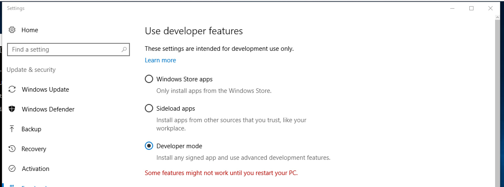
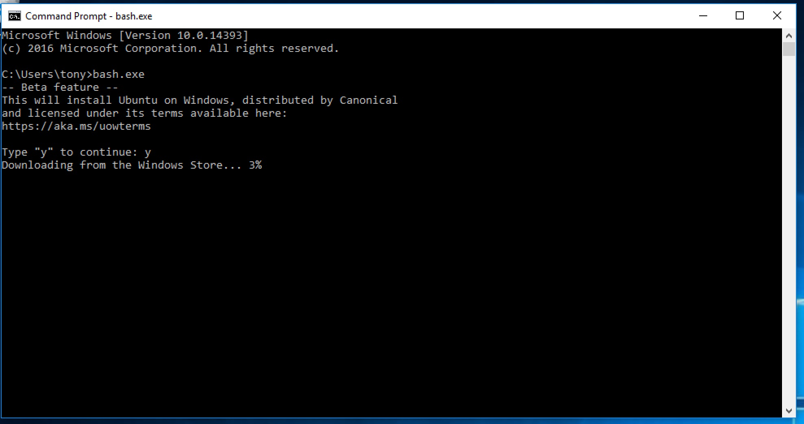
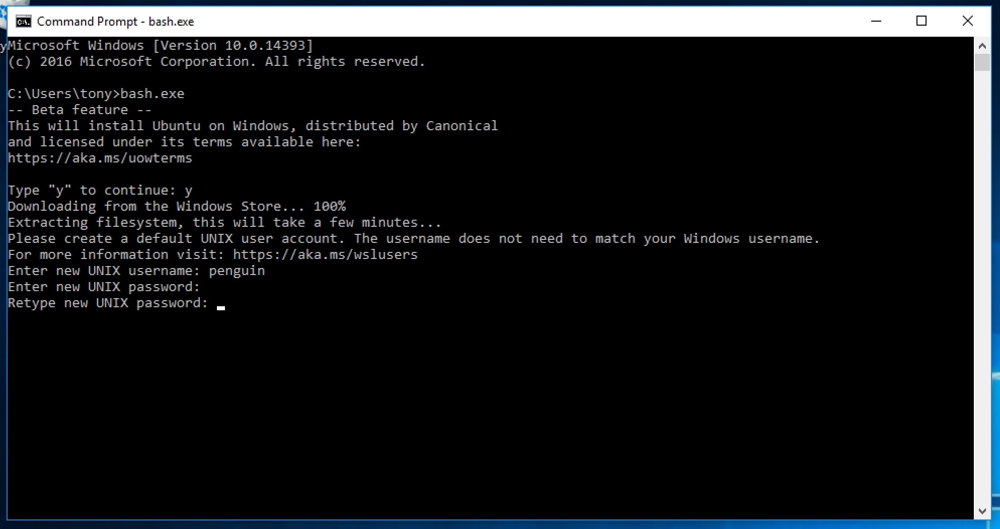
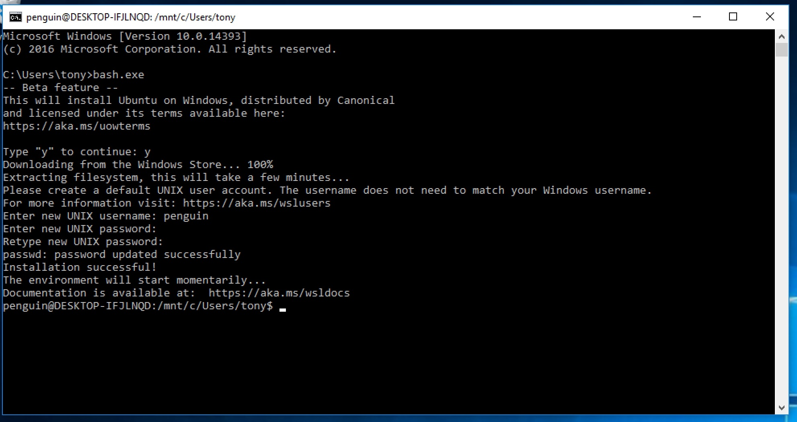
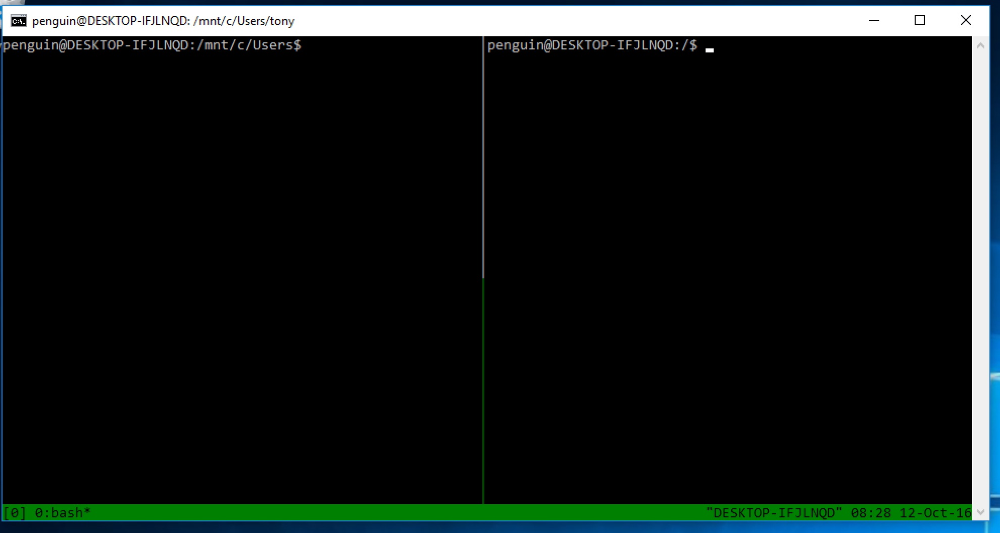

# Appendix: tmux on Windows 10 {#appendix-windows-bash}

As of Windows 10 build 14361, [you can run tmux](https://blogs.msdn.microsoft.com/commandline/2016/06/08/tmux-support-arrives-for-bash-on-ubuntu-on-windows/) via the Linux Subsystem feature.

Usage requires enabling **Developer mode** via the "For Developers" tab in the
"Update & security" settings.

After you enable that, open "Windows Features". You can find it by
searching for "Turn Windows features on or off".  Then check "Windows Subsystem
for Linux (Beta)".

You may be asked to restart.

Then open Command Prompt as you normally would (Run cli.exe). Then type

    C:\Users\tony> bash.exe

It will prompt you to agree to terms, create a user. In my build, tmux was
already installed! But if it's not, type `sudo apt-get install tmux`.

    yourusername@COMPUTERNAME-ID321FJ:/mnt/c/Users/username$ tmux

This should allow you to run tmux within bash.exe.

This is a real ubuntu installation, so you can continue to install
packages via `sudo apt-get install **packagename**` and update packages
via `sudo apt-get update && sudo apt-get upgrade`.
